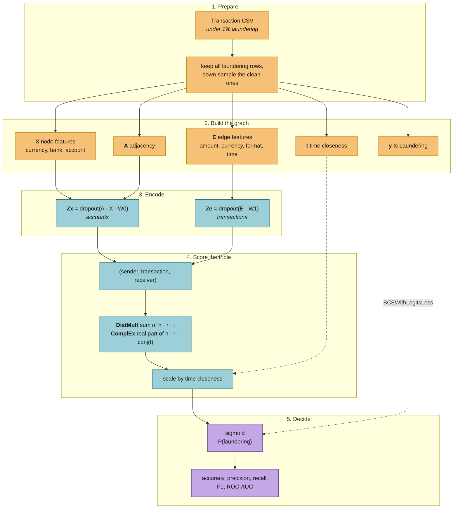
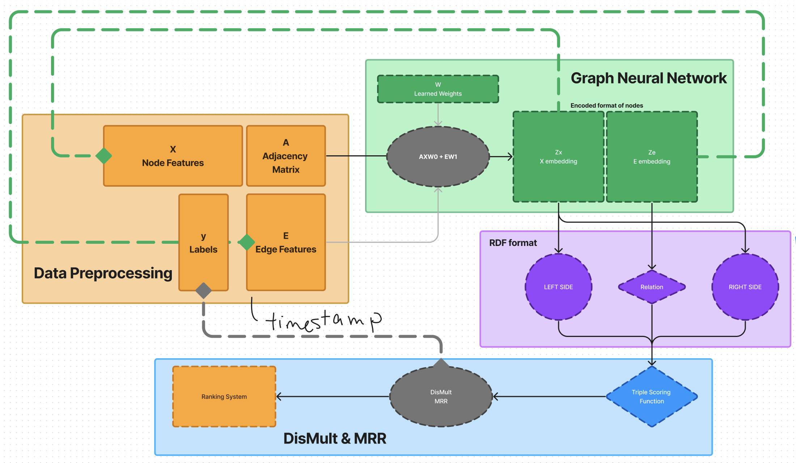
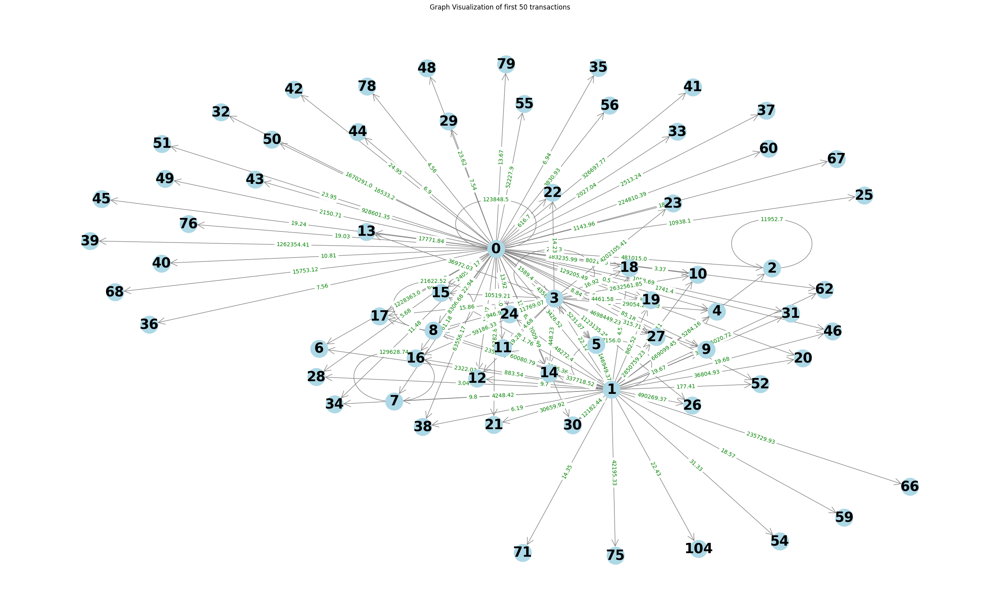

# AML Fraud Detection with Graph Neural Networks

One transaction on its own rarely looks suspicious. The path money takes
through a set of accounts often does.

This project reads a bank transaction log as a graph. Accounts are nodes,
transactions are edges. A graph neural network learns an embedding for each,
then scores every transaction as a triple of sender, transaction and receiver
to decide whether it is laundering.

Six variants are compared. Two decoders, DistMult and ComplEx, each one plain,
each one scaled by how quickly a transaction follows the sender's previous one,
and each one with that scale learned. Numbers are in [RESULTS.md](RESULTS.md).

There is also an [interactive demo](webapp/) that runs the trained model in
your browser. Pick a transaction and watch it get scored.

## Pipeline





**Why score a triple.** A transaction is already a triple of sender,
transaction and receiver. That is the shape DistMult and ComplEx were built
for, with the transaction features acting as the relation. DistMult is
symmetric and cannot tell "A paid B" from "B paid A". ComplEx splits each
embedding into a real and an imaginary half to break that symmetry.

**Why time matters.** Laundering tends to come in bursts, because funds get
moved on rather than left sitting. The time variants multiply the score by a
value near 1 when a transaction follows close behind the sender's last one, and
near 0 after a long gap.

## Setup

```bash
python -m venv .venv && source .venv/bin/activate
pip install -r requirements.txt
```

Download `HI-Small_Trans.csv` from the
[IBM Synthetic AML dataset](https://www.kaggle.com/datasets/ealtman2019/ibm-transactions-for-anti-money-laundering-aml)
into `data/`. That folder is gitignored, so no transaction data is committed.

No dataset handy? Generate a stand-in with the same schema. It plants the four
laundering shapes the real data is built from, fan-out, fan-in, cycles and
chains, next to legitimate activity with the same silhouette.

```bash
python scripts/make_synthetic_dataset.py --out data/synthetic.csv
```

## Run

```bash
python scripts/prepare_dataset.py data/HI-Small_Trans.csv --out data/balanced.csv --fraud-ratio 0.5
python scripts/build_graph.py data/balanced.csv --out data/graph.pt
python scripts/train.py --graph data/graph.pt --decoder complex --use-time --learn-time-weight
```

Add `--tune` for an Optuna search. Drop `--use-time` and `--learn-time-weight`
for the plain variants.

Runs write a checkpoint to `artifacts/` and logs and figures to `output/`, both
gitignored. `results/` holds the 2024 experiment record and is never
overwritten. Summarise a run with:

```bash
python scripts/aggregate_results.py --runs-csv output/runs.csv --markdown
```

`AMLGNN_DATA_DIR`, `AMLGNN_ARTIFACT_DIR` and `AMLGNN_OUTPUT_DIR` move those
paths, which helps on a cluster with separate scratch.

## Layout

```
src/amlgnn/    features, graph building, models, training, metrics
scripts/       command line entry points
webapp/        the browser demo, a static site
results/       the 2024 experiment record
docs/images/   diagrams
```



## A note on the numbers

The experiments in RESULTS.md came from the original 2024 code, which had
several bugs this version fixes. A double sigmoid in the loss, a learnable
weight that never trained, and a ComplEx decoder whose imaginary part was
always zero. Each one is written up in RESULTS.md with what it likely cost.
The published numbers were not rerun, so read them as a record of what the old
code did rather than a benchmark of this one.

## Author

Oskar Wang. [MIT License](LICENSE).
