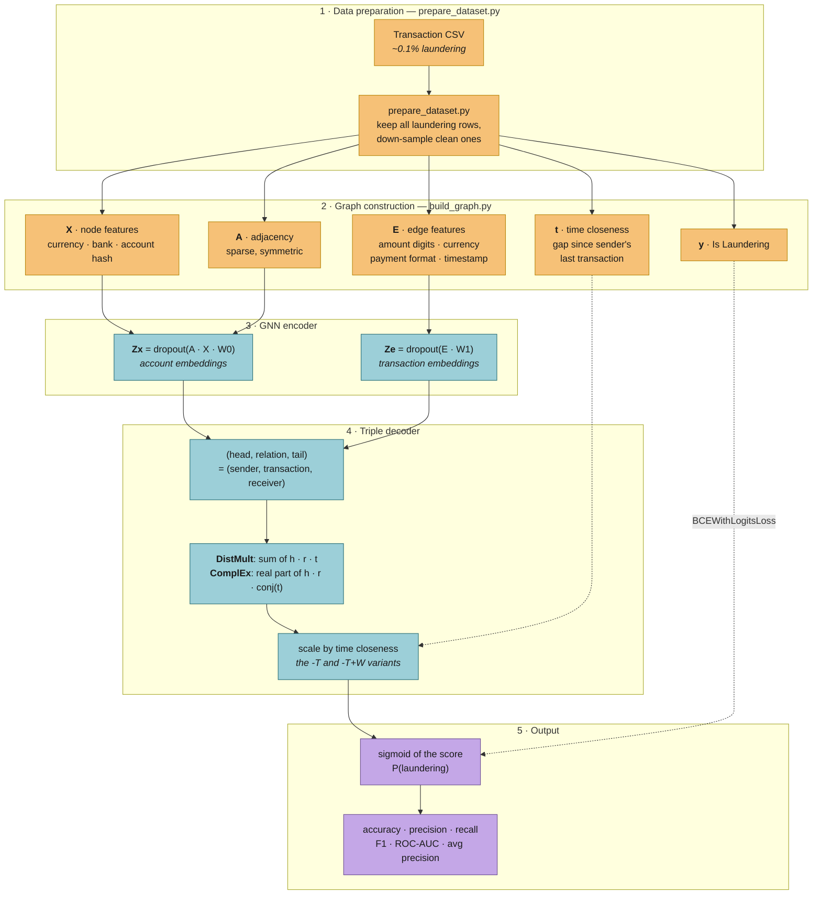

# AML Fraud Detection with Graph Neural Networks

Money laundering does not look suspicious one transaction at a time — it looks
suspicious in the *shape* of the money's path. This project treats a bank's
transaction log as a graph (accounts are nodes, transactions are edges) and
classifies each transaction as laundering or clean using a graph neural network
paired with a knowledge-graph scoring function.

Six variants are compared: two decoders (**DistMult**, **ComplEx**), each with
and without a signal for how quickly a transaction follows the sender's
previous one. Results are in **[RESULTS.md](RESULTS.md)**.

Dataset: the [IBM Synthetic AML transaction data](https://www.kaggle.com/datasets/ealtman2019/ibm-transactions-for-anti-money-laundering-aml).
It is not distributed with this repository — see [Getting the data](#1-get-the-data).

---

## The pipeline



The original hand-drawn architecture sketch, for the same thing in fewer boxes:


### Why a triple decoder?

A transaction is naturally a triple: *sender → transaction → receiver*. That is
exactly the `(head, relation, tail)` structure DistMult and ComplEx were built
to score, with the transaction's own features acting as the relation. DistMult
is symmetric, so it cannot tell "A paid B" from "B paid A"; ComplEx splits each
embedding into real and imaginary halves specifically to break that symmetry,
which matters when direction of flow is the signal you care about.

### Why time closeness?

Laundering is bursty — funds are moved on quickly rather than sitting. The `-T`
variants multiply the triple score by a value in `[0, 1]` that is near 1 when a
transaction follows hard on the sender's previous one and near 0 after a long
quiet gap. The `-T+W` variants additionally learn a scale on that gate.

---

## Quickstart

```bash
git clone https://github.com/owhygithub/prj-1-AMLFraudDetectionModel-DeepLearning-GNN-2024.git
cd prj-1-AMLFraudDetectionModel-DeepLearning-GNN-2024
python -m venv .venv && source .venv/bin/activate
pip install -r requirements.txt
```

### 1. Get the data

Download `HI-Small_Trans.csv` (or `HI-Large_Trans.csv`) from the
[Kaggle dataset](https://www.kaggle.com/datasets/ealtman2019/ibm-transactions-for-anti-money-laundering-aml)
and put it in `data/`. The directory is gitignored — no transaction data is
ever committed.

No download handy? Generate a schema-compatible fake file to exercise the
pipeline (the numbers it produces are meaningless, only the plumbing is real):

```bash
python tests/make_synthetic_csv.py --rows 20000 --out data/synthetic.csv
```

### 2. Balance and build the graph

Laundering is well under 1% of rows in the raw files, so the reported runs train
on a subset that keeps every laundering transaction and down-samples clean ones:

```bash
python scripts/prepare_dataset.py data/HI-Small_Trans.csv --out data/balanced.csv --fraud-ratio 0.5
python scripts/build_graph.py data/balanced.csv --out data/graph.pt
```

### 3. Train

```bash
# DistMult, no time signal
python scripts/train.py --graph data/graph.pt --decoder distmult

# ComplEx with a learned time gate ("ComplEx-T+W")
python scripts/train.py --graph data/graph.pt --decoder complex --use-time --learn-time-weight

# With an Optuna hyper-parameter search first
python scripts/train.py --graph data/graph.pt --decoder complex --use-time --tune --trials 32
```

Each run writes a checkpoint to `artifacts/`, a text log to `output/runs/<variant>/`,
figures to `output/figures/<variant>/`, and one row to `output/runs.csv`. All of
that is gitignored — `results/` is the committed record of the 2024 experiments
and nothing overwrites it.

### 4. Summarise

```bash
python scripts/aggregate_results.py --runs-csv output/runs.csv --markdown
```

Without `--runs-csv` it summarises the committed 2024 results instead.

Paths can be redirected with `AMLGNN_DATA_DIR`, `AMLGNN_ARTIFACT_DIR` and
`AMLGNN_OUTPUT_DIR` — useful on a cluster with a separate scratch filesystem.

---

## Layout

```
src/amlgnn/
  features.py        deterministic feature encoders (currency, amount, account, time)
  preprocessing.py   CSV → TransactionGraph (X, E, A, y, time closeness)
  models.py          GNN encoder + DistMult / ComplEx decoders
  data.py            stratified train/val/test edge splits
  metrics.py         evaluation and figures
  train.py           training loop, k-fold CV, Optuna search, run logging
scripts/             command-line entry points
notebooks/           the original exploratory notebooks (outputs stripped)
results/             the 2024 experiment record: runs.csv, run logs, figures
output/              where your own runs land (gitignored)
tests/               synthetic data generator for end-to-end smoke runs
docs/images/         architecture sketch and a sample transaction graph
```

A sample of the transaction graph — the first 50 transactions, showing the hub
structure that makes this a graph problem rather than a tabular one:


---

## Notes on this version

This repository was cleaned up in 2026 from the original 2024 thesis code. The
experiments in [RESULTS.md](RESULTS.md) were produced by the *original* code,
which contained several defects that this version fixes — most importantly a
double sigmoid in the loss, a detached "learnable" weight, and a complex decoder
whose imaginary part was always zero. Those are documented with their likely
effect in [RESULTS.md § Known defects](RESULTS.md#known-defects-in-the-original-runs).
**The published numbers have not been regenerated**, so treat them as a record
of what the original code did, not as a benchmark of what this code does.

The `torch_geometric` / `torch_scatter` / `torch_sparse` dependency stack was
removed: the layer never actually called PyG's message passing (it is a sparse
matrix multiply), and PyG was used only as a data container. The `notebooks/`
still import it and are kept as a historical record rather than a working path.

## Author

Oskar Wang. Released under the [MIT License](LICENSE).

## References

- Altman et al., *Realistic Synthetic Financial Transactions for Anti-Money Laundering Models* (NeurIPS 2023) — the dataset.
- Yang et al., *Embedding Entities and Relations for Learning and Inference in Knowledge Bases* (ICLR 2015) — DistMult.
- Trouillon et al., *Complex Embeddings for Simple Link Prediction* (ICML 2016) — ComplEx.
