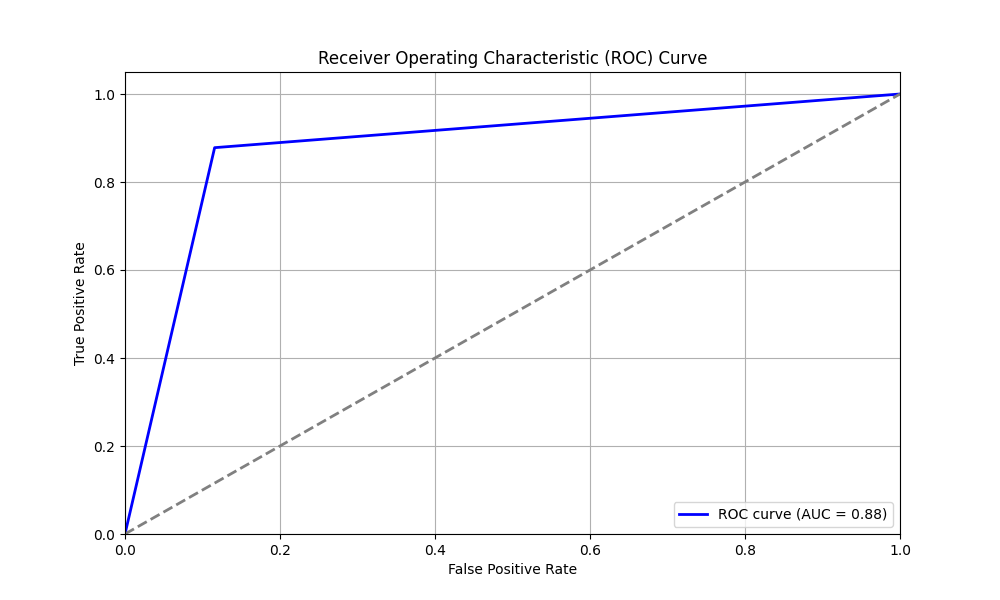
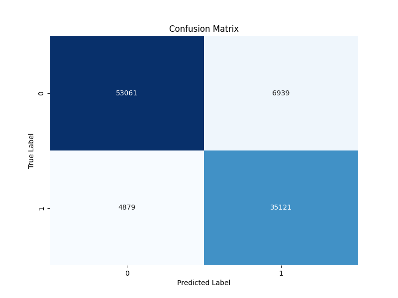

# Results

Six variants, one graph, one held out test set. All numbers below come from the
original June 2024 runs and are reproduced verbatim from
[`results/runs.csv`](results/runs.csv). They were **not** regenerated after the
2026 code cleanup. [Known defects](#known-defects-in-the-original-runs)
explains what that caveat is worth.

> The historical artefacts spell the first decoder `DisMult`. The cleaned up
> code spells it `DistMult`. Same model.

## Setup

| | |
| --- | --- |
| Source data | IBM Synthetic AML, `HI-Large_Trans.csv` |
| After balancing | 500,000 transactions, 40% laundering |
| Split | 60% train, 20% validation, 20% test, stratified |
| Test set | 100,000 transactions: 40,000 laundering, 60,000 clean |
| Model selection | 5 fold cross validation, early stopping on validation loss |
| Repeats | 7 to 8 independent runs per variant |
| Decision threshold | 0.6 on the model's output score |

Each variant's numbers below are the mean and standard deviation across its
repeats. The spread sits in the fourth decimal place because the repeats shared
a fixed data split and differed only in weight initialisation.

## Main results

| Variant | Runs | Accuracy | Precision | Recall | F1 | ROC-AUC | Loss |
| --- | ---: | ---: | ---: | ---: | ---: | ---: | ---: |
| DisMult | 7 | 0.7547 ± 0.0004 | 0.8474 ± 0.0012 | 0.4717 ± 0.0015 | 0.6060 ± 0.0010 | 0.7075 ± 0.0005 | 0.4685 ± 0.0066 |
| DisMult-T | 7 | 0.8803 ± 0.0005 | 0.8343 ± 0.0009 | **0.8745** ± 0.0018 | 0.8539 ± 0.0007 | 0.8793 ± 0.0007 | 0.6060 ± 0.0003 |
| DisMult-T+W | 7 | 0.8771 ± 0.0010 | 0.8341 ± 0.0012 | 0.8649 ± 0.0016 | 0.8492 ± 0.0013 | 0.8751 ± 0.0011 | 0.6163 ± 0.0004 |
| ComplEx | 8 | 0.8805 ± 0.0013 | 0.8330 ± 0.0019 | **0.8772** ± 0.0013 | **0.8545** ± 0.0015 | **0.8800** ± 0.0013 | 0.6034 ± 0.0007 |
| ComplEx-T | 8 | **0.8810** ± 0.0009 | 0.8445 ± 0.0011 | 0.8611 ± 0.0016 | 0.8527 ± 0.0011 | 0.8777 ± 0.0010 | 0.6017 ± 0.0005 |
| ComplEx-T+W | 8 | 0.8802 ± 0.0009 | **0.8500** ± 0.0012 | 0.8506 ± 0.0021 | 0.8503 ± 0.0012 | 0.8753 ± 0.0010 | 0.6034 ± 0.0003 |

Hyper-parameters were fixed per decoder family after an Optuna search. DistMult
used 25 embedding channels and weight decay 5e-4. ComplEx used 20 channels and
5e-5. Both used lr 0.01, dropout 0.1, and up to 100 epochs.

Regenerate this table with:

```bash
python scripts/aggregate_results.py --since 20240625153000 --markdown
```

### Confusion matrices

Derived from the mean precision and recall of each variant, over the 100,000
test transactions of which 40,000 are laundering:

| Variant | True positives | False positives | False negatives | True negatives | Flagged |
| --- | ---: | ---: | ---: | ---: | ---: |
| DisMult | 18,868 | 3,398 | 21,132 | 56,602 | 22,266 |
| DisMult-T | 34,980 | 6,948 | 5,020 | 53,052 | 41,928 |
| DisMult-T+W | 34,595 | 6,881 | 5,405 | 53,119 | 41,476 |
| ComplEx | 35,088 | 7,034 | 4,912 | 52,966 | 42,122 |
| ComplEx-T | 34,445 | 6,342 | 5,555 | 53,658 | 40,787 |
| ComplEx-T+W | 34,024 | 6,005 | 5,976 | 53,995 | 40,030 |

The five working variants all flag roughly 41,000 of 100,000 transactions to
catch roughly 34,500 of the 40,000 laundering cases. Plain `DisMult` flags half
as many and misses over half the laundering. See below for why.

Per-variant ROC curves, confusion matrices and loss curves are in
[`results/figures/`](results/figures/). For example, `ComplEx`:

| ROC curve | Confusion matrix |
| --- | --- |
|  |  |

## Reading the results

**The five working variants are indistinguishable.** F1 spans 0.8492 to 0.8545
and ROC-AUC spans 0.8751 to 0.8800. Those gaps are around 0.005, five times the
run to run standard deviation, so not quite noise but nothing that would change
a decision. Neither the choice of decoder nor the time signal moved the needle.
Given the [known defects](#known-defects-in-the-original-runs), that is what you
would expect. With a zero imaginary part ComplEx *is* DistMult, and with a
detached weight parameter `-T+W` *is* `-T`. Three of the six "variants" were
never distinct models.

**There is a precision and recall trade to pick from.** The variants sit on a
shallow frontier. `ComplEx` recovers the most laundering at recall 0.877, and
`ComplEx-T+W` raises the fewest false alarms at precision 0.850. For AML
triage, where a missed case costs more than an extra review, the recall end is
the one to take.

**Plain `DisMult` is not a fair comparison.** It is the only variant whose
script had the output sigmoid commented out, so its raw trilinear score was
thresholded at 0.6 directly rather than as a probability. That is the
equivalent of demanding `P >= 0.65` where the others demanded `P >= 0.6`, and
it explains the collapsed recall on its own. But it also has the worst ROC-AUC
at 0.707 against roughly 0.88 elsewhere, and AUC is threshold free, so the
thresholding bug is not the whole story. Unbounded trilinear scores fed
straight into the loss appear to have trained less stably than the
accidentally squashed ones. On the smaller pilot dataset, where scores had less
room to grow, the same configuration reached AUC 0.837, which is consistent
with that reading without proving it.

**MRR as logged is not informative.** The column hovers around 0.0002 for every
variant. The implementation averages `1/rank` over all 40,000 positives in a
100,000 edge ranking, so its scale is set by the number of positives rather
than by model quality. The cleaned up code keeps the metric for continuity and
adds `average_precision`, which is the ranking number to read.

## Pilot round

An earlier round on a much smaller graph of 2,000 test transactions, before the
pipeline was moved to the large dataset. Single runs, so no error bars:

| Variant | Channels | Epochs | Accuracy | Precision | Recall | F1 | ROC-AUC |
| --- | ---: | ---: | ---: | ---: | ---: | ---: | ---: |
| DisMult | 20 | 200 | 0.8795 | 0.8763 | 0.6967 | 0.7762 | 0.8273 |
| DisMult | 30 | 200 | 0.8840 | 0.8710 | 0.7200 | 0.7883 | 0.8371 |
| DisMult | 30 | 100 | 0.8860 | 0.8470 | 0.7567 | 0.7993 | 0.8490 |
| DisMult-T | 20 | 200 | 0.8900 | 0.8345 | 0.7900 | 0.8116 | 0.8614 |
| ComplEx | 15 | 100 | 0.8885 | 0.7878 | 0.8600 | 0.8223 | 0.8804 |
| ComplEx-T | 15 | 100 | 0.8765 | 0.7754 | 0.8283 | 0.8010 | 0.8627 |
| ComplEx-T+W | 15 | 100 | 0.8835 | 0.7845 | 0.8433 | 0.8129 | 0.8720 |

Accuracy barely moved between the pilot and the 50 times larger main run, while
recall improved substantially. The graph got denser rather than just bigger:
more transactions per account means more neighbourhood context for each node.

## Known defects in the original runs

Found while cleaning up the code in 2026. Each is fixed in `src/amlgnn/`. None
of them is fixed in the numbers above.

### 1. Double sigmoid in the loss

```python
normalized_scores = torch.sigmoid(raw_scores)   # in the decoder
...
criterion = nn.BCEWithLogitsLoss()              # sigmoids again
```

`BCEWithLogitsLoss` expects logits. Feeding it probabilities squashes every
prediction into `(0.5, 0.731)`, which puts a floor of about 0.54 on the loss.
The observed losses sit at 0.60 to 0.62, just above it. It also attenuates the
gradient by up to 16x and throws away the numerically stable log-sum-exp that
the fused loss exists to provide.

Affects `DisMult-T`, `DisMult-T+W`, `ComplEx`, `ComplEx-T` and `ComplEx-T+W`.
Fixed by returning logits from the decoder in `models.py`.

### 2. ComplEx was DistMult

```python
heads = torch.complex(heads, torch.zeros_like(heads))   # imaginary part = 0
raw_scores = torch.real(torch.sum(heads * ew * torch.conj(tails), dim=-1))
```

With a zero imaginary part, `conj` is the identity and the expression reduces
exactly to DistMult's `<h, r, t>`. The asymmetry that makes ComplEx worth
choosing for directed relations, where "A paid B" is not "B paid A", was never
present. Fixed by splitting each embedding into real and imaginary halves in
`complex_score`.

### 3. The learnable time weight never learned

```python
learnable_weight_tensor = torch.tensor(self.learnable_weight, ...)
```

Wrapping a `nn.Parameter` in `torch.tensor(...)` copies it out of the autograd
graph, so it received no gradient and stayed at its random initialisation for
every epoch. The `-T+W` variants are `-T` variants with a fixed random scale on
the time gate, which is consistent with `-T+W` scoring marginally *below* `-T`
in every case. Fixed by using the parameter directly.

### 4. Test edges leaked into cross validation

```python
for fold, (train_idx, val_idx) in enumerate(kf.split(range(input_data.edge_attr.shape[0]))):
```

`KFold` ran over every edge in the graph, not over the training split, so each
fold trained on roughly a fifth of the held out test edges before the same
model was evaluated on them. The reported test metrics are therefore optimistic
by an unknown margin. Fixed by folding within the training split only, in
`cross_validate`.

### 5. Non-reproducible node features

Account identifiers were vectorised with Python's builtin `hash()`, which is
salted per process, and every node also received a `random.random()` column as
a "unique ID". Node features were therefore different on every run, and one
feature was pure noise. Fixed with BLAKE2b hashing. The random column is gone.

### Structural limitations, not fixed

- **Normalisation before splitting.** Min-max scaling is fitted over the whole
  dataset at graph build time, so test set statistics inform the training
  features. Mild for engineered digit features, but it is leakage.
- **Full graph message passing.** The adjacency matrix always covers every
  edge, including test edges, so the model sees that a test transaction
  *exists* while learning. Standard for transductive link prediction, but worth
  stating.
- **One convolution layer.** Each account only ever sees its immediate
  neighbours. Laundering patterns such as layering and smurfing span several
  hops.

## Reproducing

The numbers above cannot be reproduced from this repository as it stands. The
defect fixes change the model, and the balanced 500k transaction CSV was
generated on a cluster and not kept. To run the experiments again:

```bash
python scripts/prepare_dataset.py data/HI-Large_Trans.csv --out data/balanced.csv --fraud-ratio 0.4
python scripts/build_graph.py data/balanced.csv --out data/graph.pt
python scripts/train.py --graph data/graph.pt --decoder complex --use-time --learn-time-weight --tune
```

Expect the absolute numbers to differ. The fixes cut both ways: removing the CV
leak should lower the scores, while a real ComplEx decoder and a working
gradient path should raise them.

## What would be worth trying next

1. **Normalise the score on purpose.** The accidental sigmoid appears to have
   been doing useful work. A deliberate bound, such as batch norm on the score
   or a tanh, would test that directly instead of by accident.
2. **More than one hop.** A second convolution layer would let the model see
   the chains that laundering actually looks like.
3. **Train on the real class balance.** Down-sampling to 40% laundering makes
   the problem tractable but not realistic. `pos_weight` on the loss, now
   supported via `--balance-loss`, handles the raw 0.1% ratio without throwing
   away 99% of the clean transactions.
4. **Report precision at a fixed alert budget.** How many true cases appear in
   the top 1,000 flags is the number an AML team actually operates on.
